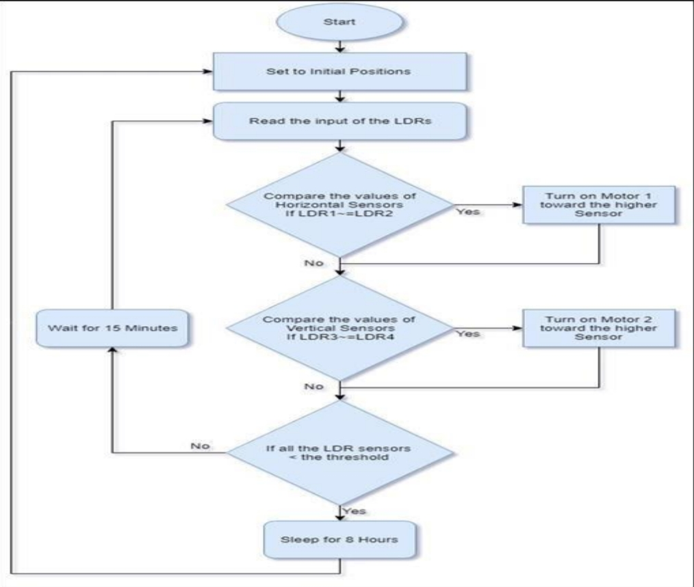
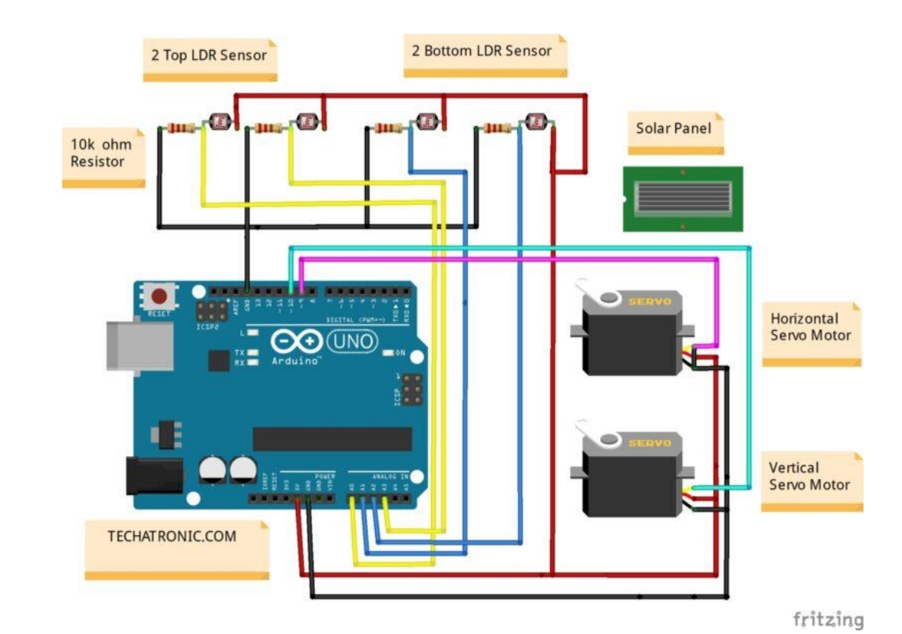

# Dual-Axis Solar Tracker  

**Dual-Axis Solar Tracking System** is an **Arduino-based automated solar tracker** that optimizes **solar panel alignment** for maximum sunlight absorption. By dynamically adjusting both **horizontal and vertical angles** using **photoresistors and servo motors**, this system increases **energy efficiency by up to 40%** compared to fixed solar panels.  

---

## 📂 Project Structure  

```
Dual-Axis-Solar-Tracker/
│── 📄 README.md               # Project documentation
│── 📄 LICENSE                 # MIT License (already added)
│── 📄 solar_tracker.ino       # Arduino source code
│── 📂 images/                 # Store images here
│   ├── circuit_diagram.jpg    # Circuit diagram
│   ├── flowchart.jpg          # Flowchart
│── 📂 hardware/               # 3D models or PCB designs
│   ├── ldr-mount.stl          # LDR sensor mounting structure
│   ├── Pan-tilt-base-camara.stl  # Base for pan-tilt mechanism
│   ├── Pan-tilt-plataforma.stl  # Platform for mounting servo motors
│   ├── Pan-tilt-tapa.stl       # Top cover for the pan-tilt assembly
```

---

## 📷 Circuit Diagram  
  

## 📊 Flowchart  
  

---

## 🚀 Features  
✅ **Real-time sun tracking** using LDR sensors  
✅ **Dual-axis movement** for optimal alignment  
✅ **Arduino-controlled** automation  
✅ **Increased energy efficiency** and solar power output  
✅ **Cost-effective & easy to implement**  

---

## 🛠 Components Used  
- **Microcontroller**: Arduino  
- **Sensors**: Photoresistors (LDRs)  
- **Motors**: Servo motors for movement  
- **Power Source**: Solar panel  
- **Framework**: Custom control algorithm for tracking  
- **Hardware Components**: 3D-printed parts for mounting and movement  

---

## 🔩 Hardware Components  

This project includes **custom-designed 3D-printed components** for mounting and movement:  

1. **ldr-mount.stl** → Holds the LDR sensors in place for accurate sunlight detection.  
2. **Pan-tilt-base-camara.stl** → Acts as the base for the pan-tilt mechanism.  
3. **Pan-tilt-plataforma.stl** → Platform for mounting servo motors and solar panel.  
4. **Pan-tilt-tapa.stl** → Top cover for securing the pan-tilt assembly.  

These **STL files** can be **3D printed** and assembled to build the physical solar tracking system.  

---

## 📌 Working Principle  
1. **Sunlight Detection**: Four **photoresistors** placed at different angles detect sunlight intensity.  
2. **Data Processing**: The **Arduino** processes input from sensors to determine the sun’s position.  
3. **Servo Motor Adjustment**: The system **rotates the solar panel** to align it perpendicular to sunlight.  
4. **Continuous Optimization**: Adjusts orientation throughout the day for **maximum energy absorption**.  

---

## 🛠 Installation  
1. Clone the repository:  
   ```bash
   git clone https://github.com/YOUR_GITHUB_USERNAME/Dual-Axis-Solar-Tracker.git
   cd Dual-Axis-Solar-Tracker
   ```  
2. Upload the **Arduino code** (`solar_tracker.ino`) to your Arduino board.  
3. Assemble the **photoresistor sensors and servo motors** as per the circuit diagram.  
4. **3D print the hardware components** located in the `hardware/` folder and assemble them.  
5. Power up the system and **test solar panel movements**.  

---

## 📝 License  
This project is licensed under the **MIT License**.  
